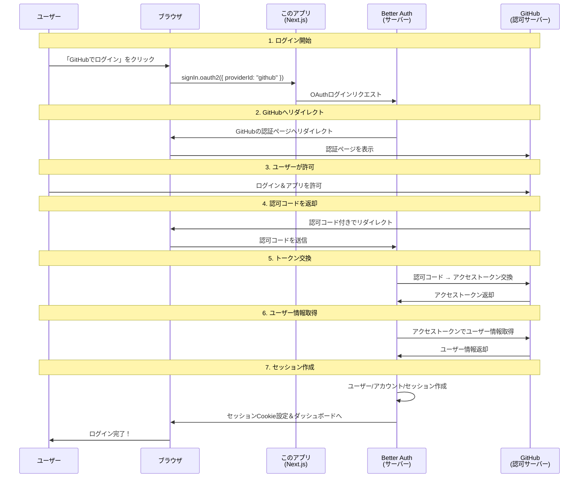
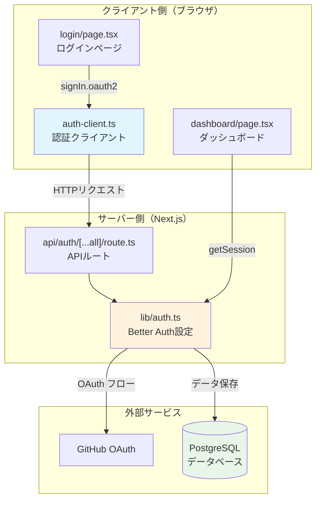
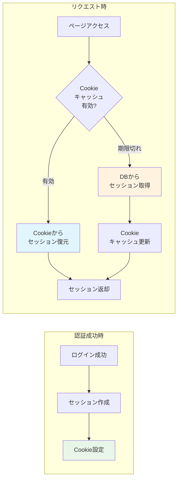
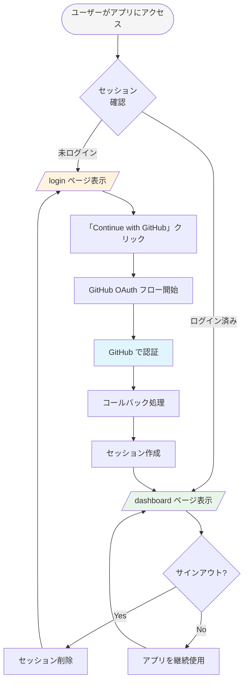
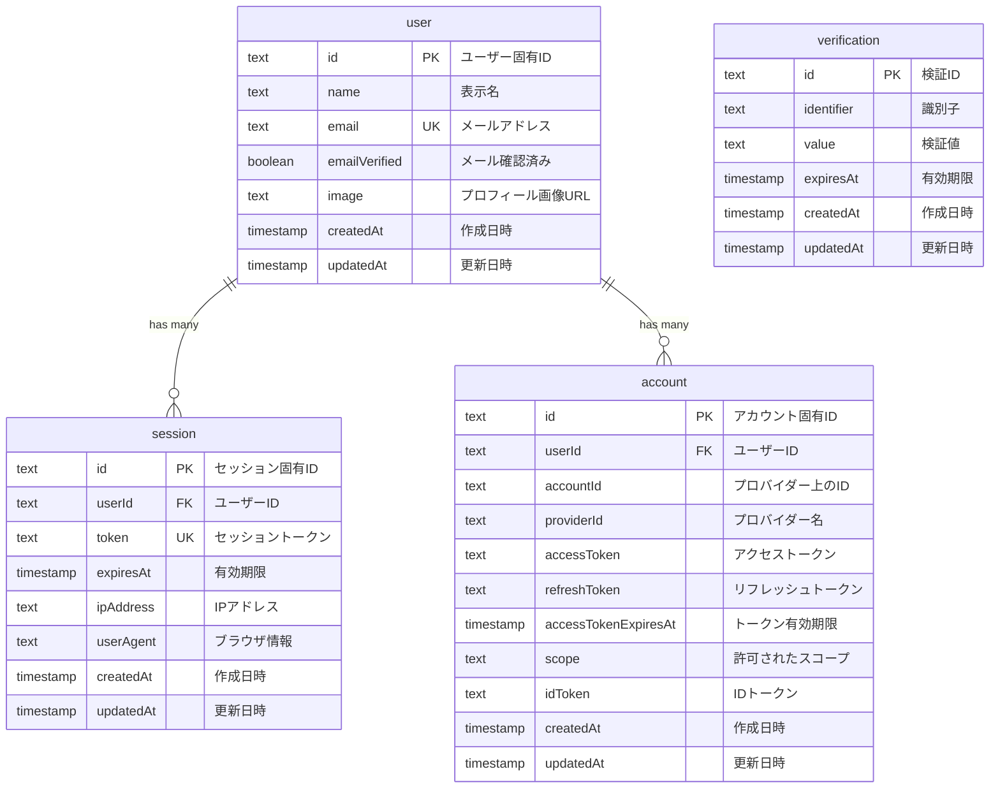
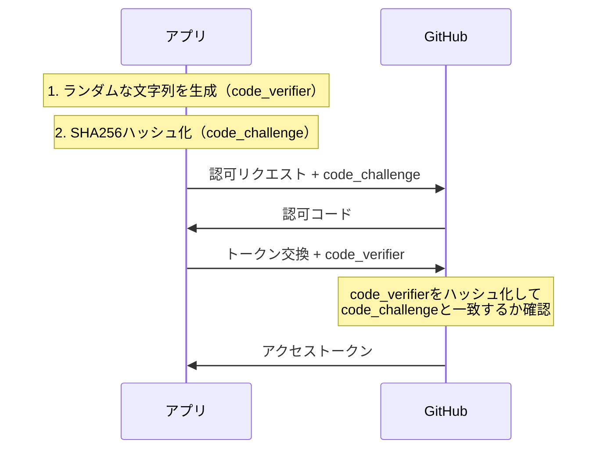

# 認証システム完全ガイド

このドキュメントでは、本プロジェクトの認証システムについて、初心者の方でも理解できるよう詳しく解説します。

## 目次

1. [認証とは？なぜ必要なのか？](#1-認証とはなぜ必要なのか)
2. [OAuth 2.0 の基礎知識](#2-oauth-20-の基礎知識)
3. [Better Auth の概要](#3-better-auth-の概要)
4. [このプロジェクトの認証フロー](#4-このプロジェクトの認証フロー)
5. [データベース構造](#5-データベース構造)
6. [セキュリティ考慮点](#6-セキュリティ考慮点)
7. [用語集](#7-用語集)

---

## 1. 認証とは？なぜ必要なのか？

### 認証（Authentication）とは

**認証**とは、「あなたが誰であるかを確認すること」です。

日常生活での例：

- 銀行のATMで暗証番号を入力する
- 会社のオフィスに入るために社員証をかざす
- 空港で入国審査官にパスポートを見せる

Webアプリケーションでは、ユーザーが「本当にそのアカウントの持ち主か」を確認するために認証が必要です。

### 認可（Authorization）との違い

| 用語                      | 説明                   | 例                                   |
| ------------------------- | ---------------------- | ------------------------------------ |
| **認証** (Authentication) | 「あなたは誰？」を確認 | ログイン画面でID/パスワードを入力    |
| **認可** (Authorization)  | 「何ができる？」を確認 | 管理者だけが設定画面にアクセスできる |

### なぜ認証が必要なのか

```
認証がないWebアプリ
┌─────────────────────────────────────┐
│  誰でもアクセス可能                   │
│  ・他人のデータが見られる              │
│  ・他人のデータを変更できる            │
│  ・悪意あるユーザーがなりすまし可能     │
└─────────────────────────────────────┘

認証があるWebアプリ
┌─────────────────────────────────────┐
│  本人確認済みのユーザーのみアクセス    │
│  ・自分のデータだけが見られる          │
│  ・自分のデータだけ変更できる          │
│  ・なりすましを防止                   │
└─────────────────────────────────────┘
```

---

## 2. OAuth 2.0 の基礎知識

### OAuth 2.0 とは

**OAuth 2.0**（オーオース 2.0）は、「第三者のサービスを使ってログインする」ための業界標準プロトコルです。

「GitHubでログイン」「Googleでログイン」というボタンを見たことがありますか？これらはOAuth 2.0を使っています。

### なぜパスワードを直接入力しないのか？

従来の方法（危険）：

```
ユーザー → 「GitHubのパスワード教えて」 → アプリA
         ↓
アプリAがGitHubのパスワードを知ってしまう（危険！）
```

OAuth 2.0の方法（安全）：

```
ユーザー → GitHubで直接ログイン → GitHub「このアプリに許可を与えますか？」
         ↓
アプリAはパスワードを知らないまま、許可された情報だけ取得できる（安全）
```

### OAuth 2.0 の登場人物

| 役割                 | 説明                         | このプロジェクトでは     |
| -------------------- | ---------------------------- | ------------------------ |
| **リソースオーナー** | ユーザー本人                 | あなた（ログインする人） |
| **クライアント**     | ログイン機能を使いたいアプリ | このNext.jsアプリ        |
| **認可サーバー**     | ログインを処理するサーバー   | GitHub                   |
| **リソースサーバー** | ユーザー情報を持つサーバー   | GitHub API               |

### OAuth 2.0 認可コードフロー（図解）

このプロジェクトで使用している「認可コードフロー」を説明します。



### 各ステップの詳細解説

#### ステップ1-2: ログイン開始からGitHubへリダイレクト

```
[ユーザーの操作]
ログインページで「Continue with GitHub」ボタンをクリック

[内部で起きること]
1. authClient.signIn.oauth2({ providerId: "github" }) が呼ばれる
2. Better Authが認可URLを生成
3. ブラウザがGitHubの認証ページにリダイレクト
```

生成される認可URL例：

```
https://github.com/login/oauth/authorize?
  client_id=あなたのClientID&
  redirect_uri=http://localhost:3000/api/auth/oauth2/callback/github&
  scope=read:user user:email&
  state=ランダムな文字列（CSRF対策）&
  code_challenge=PKCEチャレンジ（セキュリティ強化）
```

#### ステップ3: ユーザーによる許可

GitHubの画面で：

1. GitHubアカウントでログイン（未ログインの場合）
2. 「このアプリに以下の権限を許可しますか？」と表示
3. ユーザーが「Authorize」をクリック

#### ステップ4-5: 認可コードとトークン交換

```
[認可コード]
一時的な「引換券」のようなもの
- 有効期限が非常に短い（通常10分程度）
- 1回しか使えない
- これ自体ではユーザー情報にアクセスできない

[アクセストークン]
実際に情報にアクセスするための「鍵」
- より長い有効期限（数時間〜数日）
- GitHub APIを呼び出すために使用
```

#### ステップ6-7: ユーザー情報取得とセッション作成

```
[取得される情報（GitHub APIより）]
- ユーザーID（GitHub上のID）
- 名前
- メールアドレス
- プロフィール画像URL

[作成されるデータ]
- userテーブル: ユーザー基本情報
- accountテーブル: GitHubアカウント連携情報
- sessionテーブル: ログイン状態を表すセッション
```

---

## 3. Better Auth の概要

### Better Auth とは

**Better Auth** は、Next.js等のモダンなWebフレームワークで使える認証ライブラリです。

特徴：

- TypeScriptネイティブ（型安全）
- プラグインシステムで拡張可能
- セッション管理が組み込み済み
- 多数のOAuthプロバイダーに対応

### アーキテクチャ



### 主要コンポーネント

#### 1. サーバー設定 (`lib/auth.ts`)

```typescript
// Better Authのメイン設定ファイル
export const auth = betterAuth({
  // データベース接続
  database: new Pool({
    connectionString: process.env.DATABASE_URL,
  }),

  // セッション設定
  session: {
    expiresIn: 60 * 60 * 24 * 7, // 7日間有効
    updateAge: 60 * 60 * 24, // 1日ごとに更新
    cookieCache: {
      enabled: true, // Cookie キャッシュ有効
      maxAge: 5 * 60, // 5分間キャッシュ
    },
  },

  // OAuth プロバイダー設定
  plugins: [
    genericOAuth({
      config: [
        {
          providerId: 'github',
          clientId: process.env.GITHUB_CLIENT_ID!,
          clientSecret: process.env.GITHUB_CLIENT_SECRET!,
          // ... 詳細設定
        },
      ],
    }),
  ],
});
```

#### 2. クライアント設定 (`lib/auth-client.ts`)

```typescript
// ブラウザ側で使用する認証クライアント
export const authClient = createAuthClient({
  plugins: [
    genericOAuthClient(), // OAuth2のsignInメソッドを有効化
  ],
});

// よく使う関数をエクスポート
export const { signIn, signOut, useSession } = authClient;
```

#### 3. APIルート (`app/api/auth/[...all]/route.ts`)

```typescript
// すべての認証リクエストをBetter Authにルーティング
import { auth } from '@/lib/auth';
import { toNextJsHandler } from 'better-auth/next-js';

export const { POST, GET } = toNextJsHandler(auth);
```

このルートは以下のエンドポイントを自動的に処理します：

- `GET /api/auth/session` - セッション取得
- `POST /api/auth/sign-in/oauth2` - OAuthログイン開始
- `GET /api/auth/oauth2/callback/github` - コールバック処理
- `POST /api/auth/sign-out` - ログアウト

### セッション管理の仕組み



#### Cookie キャッシュとは

通常、セッション確認のたびにデータベースにアクセスすると：

- データベースへの負荷が増加
- レスポンス時間が遅くなる

Cookie キャッシュは：

- セッション情報を署名付きCookieに保存
- 5分間はCookieから直接読み取り
- データベースアクセスを削減
- 高速なレスポンスを実現

---

## 4. このプロジェクトの認証フロー

### 全体像



### ログインページ (`app/login/page.tsx`)

```typescript
"use client";

export default function LoginPage() {
  // GitHubログインを開始する関数
  const handleGitHubSignIn = async () => {
    try {
      await authClient.signIn.oauth2({
        providerId: "github",     // 使用するプロバイダー
        callbackURL: "/dashboard", // 成功後のリダイレクト先
      });
    } catch (error) {
      toast.error("Failed to sign in with GitHub");
    }
  };

  return (
    <Button onClick={handleGitHubSignIn}>
      <Github />
      Continue with GitHub
    </Button>
  );
}
```

**ポイント:**

- `"use client"` - これはクライアントコンポーネント（ブラウザで実行）
- `signIn.oauth2()` - genericOAuthプラグインが提供するメソッド
- `callbackURL` - 認証成功後にリダイレクトされる先

### ダッシュボード (`app/dashboard/page.tsx`)

```typescript
// これはサーバーコンポーネント（サーバーで実行）
export default async function DashboardPage() {
  // サーバー側でセッションを取得
  const session = await auth.api.getSession({
    headers: await headers(),
  });

  // 未ログインならログインページへリダイレクト
  if (!session) {
    redirect("/login");
  }

  // GitHubのアクセストークンも取得可能
  const githubToken = await auth.api.getAccessToken({
    body: { providerId: "github" },
    headers: await headers(),
  });

  return (
    <div>
      <p>User ID: {session.user.id}</p>
      <p>Email: {session.user.email}</p>
      <p>Name: {session.user.name}</p>
      {/* ... */}
    </div>
  );
}
```

**ポイント:**

- サーバーコンポーネントなので、DBに直接アクセス可能
- `auth.api.getSession()` でセッション確認
- 未認証ユーザーは自動的にログインページへ
- `getAccessToken()` でGitHub APIを呼び出すためのトークンも取得可能

### サインアウト (`app/dashboard/dashboard-client.tsx`)

```typescript
"use client";

export function DashboardClient() {
  const handleSignOut = async () => {
    await signOut();
    router.push("/login");
  };

  return (
    <Button onClick={handleSignOut}>
      Sign Out
    </Button>
  );
}
```

**サインアウト時に起きること:**

1. サーバーにサインアウトリクエスト送信
2. データベースからセッションレコードを削除
3. ブラウザのセッションCookieを削除
4. ログインページにリダイレクト

---

## 5. データベース構造

### テーブル関係図



### 各テーブルの詳細

#### user テーブル

ユーザーの基本情報を保存します。

| カラム          | 型        | 説明                                             |
| --------------- | --------- | ------------------------------------------------ |
| `id`            | TEXT      | 一意のユーザー識別子（Better Authが自動生成）    |
| `name`          | TEXT      | GitHubから取得した表示名                         |
| `email`         | TEXT      | GitHubから取得したメールアドレス（ユニーク制約） |
| `emailVerified` | BOOLEAN   | メールが確認済みかどうか                         |
| `image`         | TEXT      | GitHubのプロフィール画像URL                      |
| `createdAt`     | TIMESTAMP | ユーザー作成日時                                 |
| `updatedAt`     | TIMESTAMP | 最終更新日時                                     |

```sql
-- 実際のテーブル定義
CREATE TABLE IF NOT EXISTS "user" (
    "id" TEXT NOT NULL PRIMARY KEY,
    "name" TEXT NOT NULL,
    "email" TEXT NOT NULL UNIQUE,
    "emailVerified" BOOLEAN NOT NULL DEFAULT FALSE,
    "image" TEXT,
    "createdAt" TIMESTAMP NOT NULL DEFAULT CURRENT_TIMESTAMP,
    "updatedAt" TIMESTAMP NOT NULL DEFAULT CURRENT_TIMESTAMP
);
```

#### session テーブル

ログイン状態（セッション）を管理します。

| カラム      | 型        | 説明                                       |
| ----------- | --------- | ------------------------------------------ |
| `id`        | TEXT      | セッション識別子                           |
| `userId`    | TEXT      | 紐づくユーザーのID（外部キー）             |
| `token`     | TEXT      | セッショントークン（Cookieに保存される値） |
| `expiresAt` | TIMESTAMP | セッションの有効期限                       |
| `ipAddress` | TEXT      | ログイン時のIPアドレス                     |
| `userAgent` | TEXT      | ログイン時のブラウザ情報                   |

**なぜIPアドレスとUser-Agentを保存するのか？**

- セキュリティ監査のため
- 不審なログインを検出するため
- 「どのデバイスからログインしているか」を表示するため

#### account テーブル

OAuthプロバイダー（GitHub等）との連携情報を保存します。

| カラム         | 型   | 説明                                           |
| -------------- | ---- | ---------------------------------------------- |
| `id`           | TEXT | アカウント識別子                               |
| `userId`       | TEXT | 紐づくユーザーのID                             |
| `accountId`    | TEXT | プロバイダー上でのユーザーID（GitHub ID等）    |
| `providerId`   | TEXT | プロバイダー名（"github"等）                   |
| `accessToken`  | TEXT | GitHub APIを呼ぶためのトークン                 |
| `refreshToken` | TEXT | アクセストークンを更新するためのトークン       |
| `scope`        | TEXT | 許可されたスコープ（"read:user user:email"等） |

**なぜアクセストークンを保存するのか？**

- ユーザーに代わってGitHub APIを呼び出すため
- 例：GitHubリポジトリ一覧の取得、プロフィール更新など

#### verification テーブル

メール確認やパスワードリセットなど、一時的な検証データを保存します。

| カラム       | 型        | 説明                         |
| ------------ | --------- | ---------------------------- |
| `identifier` | TEXT      | 検証対象（メールアドレス等） |
| `value`      | TEXT      | 検証トークン                 |
| `expiresAt`  | TIMESTAMP | 有効期限                     |

### データの流れ（具体例）

```
[初回GitHubログイン時]

1. GitHubから取得した情報:
   - GitHub ID: 12345678
   - name: "Taro Yamada"
   - email: "taro@example.com"
   - avatar_url: "https://avatars.githubusercontent.com/u/12345678"

2. 作成されるレコード:

   user テーブル:
   ┌──────────────────────────────────────────────────────┐
   │ id: "abc123..."                                      │
   │ name: "Taro Yamada"                                  │
   │ email: "taro@example.com"                            │
   │ image: "https://avatars.githubusercontent.com/..."   │
   └──────────────────────────────────────────────────────┘

   account テーブル:
   ┌──────────────────────────────────────────────────────┐
   │ id: "def456..."                                      │
   │ userId: "abc123..." (↑のユーザーを参照)               │
   │ accountId: "12345678" (GitHub上のID)                 │
   │ providerId: "github"                                 │
   │ accessToken: "gho_xxxx..." (GitHub APIアクセス用)    │
   └──────────────────────────────────────────────────────┘

   session テーブル:
   ┌──────────────────────────────────────────────────────┐
   │ id: "ghi789..."                                      │
   │ userId: "abc123..."                                  │
   │ token: "session_xxxx..." (Cookieに保存)              │
   │ expiresAt: 7日後                                     │
   │ ipAddress: "192.168.1.1"                             │
   │ userAgent: "Mozilla/5.0..."                          │
   └──────────────────────────────────────────────────────┘
```

---

## 6. セキュリティ考慮点

### このプロジェクトで実装されているセキュリティ対策

#### 1. PKCE (Proof Key for Code Exchange)



**PKCEが防ぐ攻撃:**

- 認可コード傍受攻撃
- 悪意のあるアプリが認可コードを横取りしてトークンを取得することを防止

**設定箇所 (`lib/auth.ts`):**

```typescript
genericOAuth({
  config: [
    {
      providerId: 'github',
      pkce: true, // PKCE有効化
      // ...
    },
  ],
});
```

#### 2. State パラメータ（CSRF対策）

```
[攻撃シナリオ（State パラメータがない場合）]

1. 攻撃者が自分のアカウントでOAuth認証を開始
2. コールバックURLを被害者に送りつける
3. 被害者がリンクをクリック
4. 被害者のブラウザで攻撃者のアカウントでログインしてしまう
   → 被害者の操作が攻撃者のアカウントに紐づく危険性

[State パラメータによる防御]

1. OAuthフロー開始時にランダムなstateを生成しセッションに保存
2. コールバック時にstateが一致するか確認
3. 攻撃者はセッションを知らないのでstateを偽造できない
```

Better Authは自動的にstateパラメータを生成・検証します。

#### 3. セッションCookieのセキュリティ

```typescript
// Better Authが自動設定するCookie属性

{
  httpOnly: true,    // JavaScriptからアクセス不可（XSS対策）
  secure: true,      // HTTPS通信でのみ送信（本番環境）
  sameSite: "lax",   // 異なるサイトからのリクエストでは送信しない（CSRF対策）
  signed: true,      // 署名付き（改ざん検出）
}
```

| 属性       | 説明                   | 防ぐ攻撃                     |
| ---------- | ---------------------- | ---------------------------- |
| `httpOnly` | JavaScriptから読めない | XSS攻撃によるセッション窃取  |
| `secure`   | HTTPSのみで送信        | 通信傍受によるセッション窃取 |
| `sameSite` | 同一サイトからのみ送信 | CSRF攻撃                     |
| `signed`   | 改ざん検出             | Cookie改ざん                 |

#### 4. セッションの有効期限とリフレッシュ

```typescript
session: {
  expiresIn: 60 * 60 * 24 * 7,  // 7日間で期限切れ
  updateAge: 60 * 60 * 24,      // 1日ごとに期限を延長
}
```

**なぜ期限を設けるのか？**

- 長期間使われないセッションを自動的に無効化
- 万が一セッションが漏洩しても、被害を限定的に

**なぜリフレッシュするのか？**

- アクティブなユーザーは再ログイン不要
- 使っている間は期限が延長され続ける

#### 5. Cookie キャッシュの署名

```typescript
cookieCache: {
  enabled: true,
  maxAge: 5 * 60,  // 5分
}
```

Cookieキャッシュは**署名付き**で保存されます：

- サーバーの秘密鍵で署名
- クライアント側で改ざんすると署名が無効に
- 改ざんを検出した場合、DBから再取得

### 注意すべきセキュリティ事項

#### 環境変数の管理

```bash
# .env ファイル（絶対にGitにコミットしない！）
GITHUB_CLIENT_ID=your_client_id
GITHUB_CLIENT_SECRET=your_client_secret  # ← 特に重要！
DATABASE_URL=postgresql://...
BETTER_AUTH_SECRET=your_random_secret
```

**CLIENT_SECRETが漏洩すると:**

- 攻撃者があなたのアプリになりすましてOAuth認証可能
- ユーザーが知らずに攻撃者にデータを渡してしまう

#### リダイレクトURIの検証

GitHubのOAuth設定で許可するコールバックURLを限定：

```
http://localhost:3000/api/auth/oauth2/callback/github  (開発用)
https://your-domain.com/api/auth/oauth2/callback/github  (本番用)
```

**これを怠ると:**

- オープンリダイレクト攻撃の危険性
- 攻撃者のサイトに認可コードが送られる可能性

#### アクセストークンの扱い

```typescript
// ダッシュボードでの表示（truncated）
<p>Access Token: {githubToken.accessToken?.substring(0, 20)}...</p>
```

- フルトークンはログに出力しない
- クライアントサイドに必要以上に渡さない
- 必要最小限のスコープのみ要求

---

## 7. 用語集

| 用語                     | 英語                        | 説明                                               |
| ------------------------ | --------------------------- | -------------------------------------------------- |
| **認証**                 | Authentication              | ユーザーが誰であるかを確認すること                 |
| **認可**                 | Authorization               | ユーザーに特定のリソースへのアクセスを許可すること |
| **OAuth 2.0**            | OAuth 2.0                   | 安全に認可を行うための業界標準プロトコル           |
| **OIDC**                 | OpenID Connect              | OAuth 2.0の上に構築された認証レイヤー              |
| **アクセストークン**     | Access Token                | APIにアクセスするための資格情報                    |
| **リフレッシュトークン** | Refresh Token               | アクセストークンを更新するためのトークン           |
| **認可コード**           | Authorization Code          | アクセストークンと交換するための一時的なコード     |
| **セッション**           | Session                     | ユーザーのログイン状態を表すサーバー側のデータ     |
| **Cookie**               | Cookie                      | ブラウザに保存される小さなデータ                   |
| **PKCE**                 | Proof Key for Code Exchange | 認可コード傍受攻撃を防ぐセキュリティ拡張           |
| **CSRF**                 | Cross-Site Request Forgery  | 他サイトから不正なリクエストを送る攻撃             |
| **XSS**                  | Cross-Site Scripting        | 悪意のあるスクリプトを注入する攻撃                 |
| **Client ID**            | Client ID                   | OAuthアプリケーションを識別する公開ID              |
| **Client Secret**        | Client Secret               | OAuthアプリケーションを認証する秘密鍵              |
| **スコープ**             | Scope                       | アプリが要求するアクセス権限の範囲                 |
| **コールバックURL**      | Callback URL                | OAuth認証後にリダイレクトされるURL                 |

---

## まとめ

このドキュメントで学んだこと：

1. **認証の基本** - ユーザーが「誰であるか」を確認する仕組み
2. **OAuth 2.0** - 安全に第三者サービスでログインするプロトコル
3. **Better Auth** - Next.jsで使える認証ライブラリの設定と使い方
4. **データフロー** - ログインからセッション作成までの流れ
5. **データベース** - ユーザー・セッション・アカウント情報の保存方法
6. **セキュリティ** - PKCE、CSRF対策、Cookie設定など

認証は複雑に見えますが、Better Authのようなライブラリを使うことで、セキュリティのベストプラクティスを簡単に実装できます。

---

_このドキュメントは2024年に作成されました。Better Authのバージョンアップにより、一部の仕様が変更される可能性があります。_
